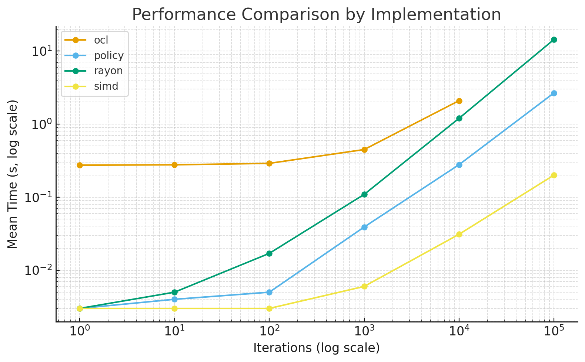

# Rule 110

### Result in my machine

| Iter | Version | Mean (s) |
|-----:|:--------|---------:|
| 1 | policy | 0.003 |
| 1 | simd | 0.003 |
| 1 | rayon | 0.003 |
| 1 | ocl | 0.274 |
| 10 | policy | 0.004 |
| 10 | simd | 0.003 |
| 10 | rayon | 0.005 |
| 10 | ocl | 0.277 |
| 100 | policy | 0.005 |
| 100 | simd | 0.003 |
| 100 | rayon | 0.017 |
| 100 | ocl | 0.290 |
| 1000 | policy | 0.039 |
| 1000 | simd | 0.006 |
| 1000 | rayon | 0.109 |
| 1000 | ocl | 0.448 |
| 10000 | policy | 0.278 |
| 10000 | simd | 0.031 |
| 10000 | rayon | 1.198 |
| 10000 | ocl | 2.091 |
| 100000 | policy | 2.663 |
| 100000 | simd | 0.200 |
| 100000 | rayon | 14.345 |
